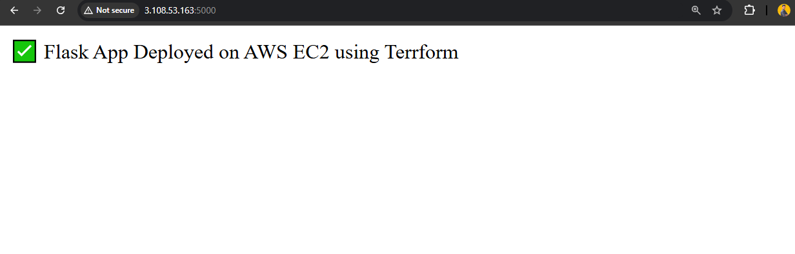

# 3-Tier AWS Architecture using Terraform


---

## Project Overview
This project demonstrates a **3-Tier Web Application Architecture** on **AWS**, deployed automatically using **Terraform**. The architecture follows industry best practices and separates each tier physically for scalability, fault tolerance, and security.

### Architecture Components
- **Presentation Tier (Web Layer):** Application Load Balancer (ALB) distributes traffic to EC2 instances in private subnets.
- **Application Tier:** Python Flask web application hosted on EC2 instances.
- **Database Tier:** Multi-AZ Amazon RDS instance for high availability.

A detailed architecture diagram is available in the repository as `architecture.txt`.

---

## Features
- Fully automated infrastructure provisioning using Terraform.
- Multi-AZ setup for fault tolerance.
- Security groups for controlled access between tiers.
- Flask application automatically deployed via EC2 user data.
- Output values display ALB DNS endpoint post-deployment.

---

## Technologies Used
| Category | Tools / Services |
|-----------|------------------|
| Cloud Provider | AWS |
| IaC Tool | Terraform |
| Compute | EC2 (t2.micro) |
| Load Balancer | Application Load Balancer (ALB) |
| Database | Amazon RDS (MySQL) |
| Language / Framework | Python Flask |
| Networking | VPC, Subnets, Route Tables, Security Groups |

---

## Terraform File Structure
```
3-tier-aws-terraform/
│
├── main.tf              # Main infrastructure configuration
├── variables.tf         # Input variables
├── outputs.tf           # Terraform outputs (ALB DNS, etc.)
├── provider.tf          # AWS provider configuration
├── architecture.txt     # ASCII diagram of architecture
└── README.md            # Documentation
```

---

## How to Deploy
1. Clone this repository:
   ```bash
   git clone https://github.com/KrishnaaCloud/3-Tier-AWS-Terraform.git
   cd 3-Tier-AWS-Terraform
   ```

2. Initialize Terraform:
   ```bash
   terraform init
   ```

3. Review the plan:
   ```bash
   terraform plan -out plan.out
   ```

4. Apply the configuration:
   ```bash
   terraform apply -auto-approve plan.out
   ```

5. Once deployed, check the **ALB DNS output** from Terraform. The Flask app should be accessible at that URL.

---

## Flask Application
The Flask web application is hosted on EC2 instances using a simple Python-based server (`app.py`). The code is pulled automatically from the GitHub repository during EC2 initialization.

**Flask app output screenshot:**
> 

---

## Cleanup
Once testing or demonstration is complete, destroy all AWS resources to avoid charges:
```bash
terraform destroy -auto-approve
```

---

## Resources and References
- [Terraform Documentation](https://developer.hashicorp.com/terraform/docs)
- [AWS EC2 Documentation](https://docs.aws.amazon.com/ec2/)
- [AWS RDS Documentation](https://docs.aws.amazon.com/rds/)
- [Flask Framework Docs](https://flask.palletsprojects.com/)

---

**Author:** Jothi Krishna M 
**Purpose:** CloudOps & DevOps Portfolio Project — 3-Tier AWS Architecture using Terraform

